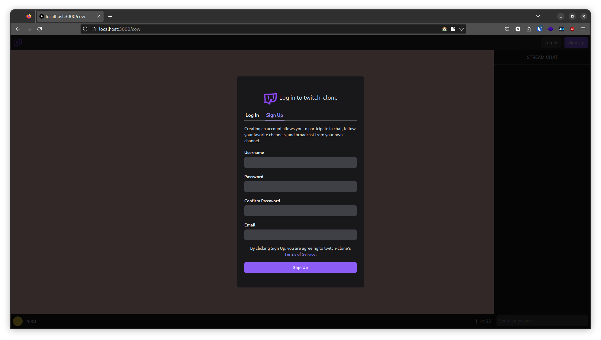

# twitch-clone

A Twitch clone to experiment with various technologies.



## Technologies
- ScyllaDB for storing messages, compatible with Cassandra but much faster. Usage is inspired by Discord's usage of the technology. 
- Ory Kratos for auth, a very comprehensive open-source Auth0 competitor.
- Sentry for client-side monitoring, to help find bugs or other issues early.
- Next.JS for the frontend, React with SSR important for SEO and to speed up the initial load.
- Tailwind for styling, eliminating the need to manage stylesheets.

## Dependencies
- [podman](https://github.com/containers/podman)
- [pnpm](https://github.com/pnpm/pnpm)
- [node](https://github.com/nodejs/node)
- [go](https://github.com/golang/go)

## Usage
Start the necessary infrastructure:
```sh
podman-compose up
```

Start the frontend:
```sh
cd client
pnpm i
pnpm run dev
```

Start the chat-service:
```
go run ./cmd/chat-service/main.go
```

## Disclaimer
I am in no way affiliated with Amazon or Twitch.
